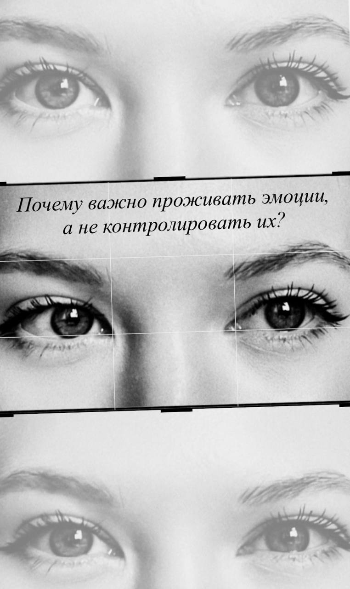

От того, как мы обращаемся с эмоциями - замечаем, принимаем, выражаем или подавляем - зависит качество нашей жизни.

Вы наверняка слышали, как про чувствительных людей говорят: «слабый», «неженка». В нашей культуре все ее не принято показывать, что происходит внутри, а вот силу духа и стойкость принято ценить. 

Но стойкость и умение справляться со своими эмоциями - не то же самое, что эмоциональная закрытость. 

За суровостью, отстраненностью и привычной маской скрываются чувства, которые никуда не исчезли. Если постоянно пытаться их контролировать или подавлять, они все равно будут находить выход (через раздражительность, резкие слова, неожиданные нервные срывы, напряжение в теле, ощущение кома в горле). 

И тогда за внешней стойкостью может оставаться очень уязвимая часть нас, которой просто не дали места. 

## Как дать эмоциям место, даже если выразить их прямо сейчас нельзя

Что произойдет, если позволить себе прожить эмоции? 
Они не будут накапливаться, как гора бумаг на рабочем столе, а будут своевременно перерабатываться и проходить свой естественный путь через возможность быть собой в разных состояниях. 

А что делать, если я злюсь прямо сейчас, а ситуация совсем не позволяет выразить все, что чувствую? 

Можно начать с простого - называть эмоцию. 
«Меня сейчас злит, что…»
«Я очень раздражен из-за…»
Можно мысленно высказать все, что хочется сказать вживую, не направляя это на другого человека. А еще, можно дать эмоции немного пространства через движение тела, дыхание, письмо от руки. 

Простая формула: 

1️⃣Определить свои эмоции и чувства (10-30 секунд понаблюдайте за мыслями, ощущениями) 

2️⃣Контакт со своим телом (продолжая наблюдать за мыслями и чувствами, медленно упритесь ступнями ног в пол, потянитесь всем телом, сделайте глубокий вдох и выдох прочувствуйте свое тело любым способом) 

3️⃣Вовлеченность (продолжая наблюдение и контакт с телом, сосредоточьте свое внимание на том, чем занимаетесь) 

▪️Так можно справиться с бурей эмоций▪️

А если я чувствую разочарование, обиду или печаль? Что если хочется плакать прямо при других людях? 

Слезы - это наша естественная реакция на переживания и стресс. Плакать ≠ быть слабым. Это способ организма справиться со своим эмоциональным напряжением. 

Думаю, здесь важно увидеть разницу между «Я должен контролировать себя» и «Я могу позаботиться о себе в этом состоянии и поддержать себя». 

Когда мы даем себе возможность признать уязвимость, что нам сейчас больно/страшно/плохо/грустно, то сами себе даем опору. 

Мы всегда можем выбирать, как выражать свои чувства, каким способом, не запрещая себе чувствовать то, что уже возникло. Ведь эмоции - это нормальная часть нас, часть нашей человеческой природы.