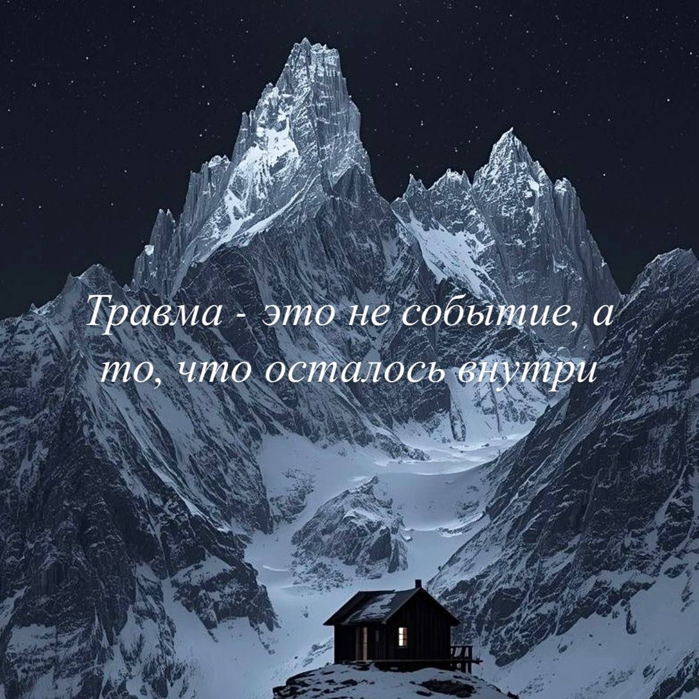

Травма - это осколки стекла внутри. Не один, а множество мелких, почти незаметных. Они не всегда болят на постоянной основе, но при определенных движениях  ранят. И будто замораживают что-то живое внутри. 

Травму нельзя стереть или вычеркнуть. Это наш опыт, пусть и очень болезненный, иногда очень тяжелый, но это часть нашей истории. 

Однако, можно не жить все время в этой боли. 

## Яма на тропинке: как выходить из сценария проваливания

Представьте тропинку, по которой вы ходите каждый день. И в каком-то месте на ней есть яма. Сначала вы ее не замечаете, но снова и снова в нее проваливаетесь. 

Яма - это травма, травматический опыт. Он возвращает не только мыслями, но и телом, эмоциями, реакциями. Потому что тело помнит все, даже если разум старается забыть. 

Эта яма на тропинке никогда не исчезает. Но появляется возможность ее замечать. И здесь происходит первый выбор: остановиться, обойти или переступить. Постепенно решать, как реагировать, что делать иначе, как проявить сочувствие к себе, поддержку и перестать автоматически проваливаться. 

Чем больше способов, тем реже происходят провалы. 

Как понять, что становится легче? 

🧊Когда появляется принятие того, что это со мной было

🧊Когда вина, самокритика, жестокость к себе и саморазрушение заменяются состраданием и сочувствием

🧊Когда можно смотреть не только назад, но и на настоящее и будущее

🧊Когда о случившемся можно говорить спокойно, оставаясь здесь и сейчас. 

Это все путь. Иногда он действительно долгий. Но можно проживать это снова и снова, падать в яму десятилетиями. А можно постепенно выходить из сложившегося сценария. 

И если в одиночку справляться сложно, это нормально. Можно не идти этот путь одному.