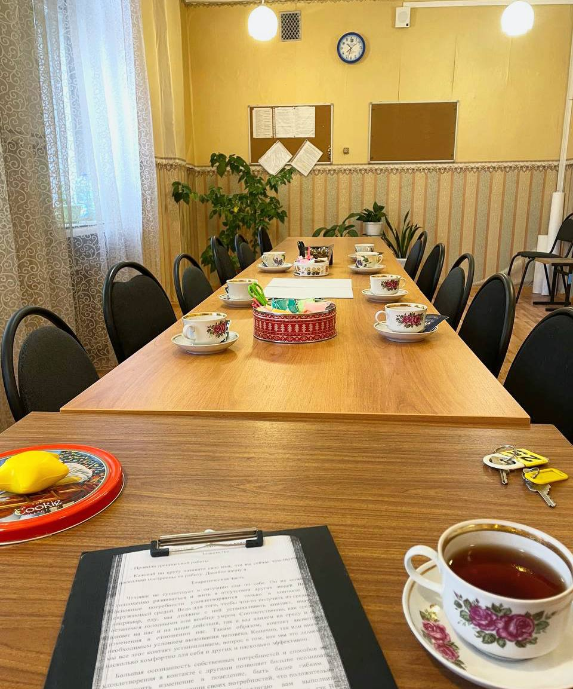

Мы все находимся во взаимодействии с этим миром. Контакт — это двусторонний процесс. Среда влияет на нас так же, как и мы влияем на неё. В контакте проявляются наши границы, привычные реакции, ожидания и притязания.

## Кому-то легко, кому-то — нет

Кому-то контакт даётся легко: он устанавливается быстро и остаётся устойчивым. У кого-то возникают сложности с его установлением или удерживанием.

## Замечание даёт выбор

И когда мы начинаем замечать, появляется больше выбора: как реагировать, как выстраивать отношения, как оставаться заботливыми для себя и для другого.

## Живой опыт вместо теории

Сегодняшний тренинг на контакт — про живой опыт, внимание к себе и возможность увидеть себя во взаимодействии яснее.

Ещё год назад в процессе обучения к нам приходили опытные гештальт-терапевты и познакомили с этим тренингом. А теперь я могу с интересом наблюдать за тем, как разворачивается эта работа у нас в коллективе.

## Вопросы к себе

- 👥 А что вы обычно чувствуете, находясь в контакте с другим человеком?
- 🙌 Удовлетворены ли тем, как проявляетесь в этом взаимодействии?

---

*Эта статья — не медицинская рекомендация. Рекомендуется обращаться к специалистам.*