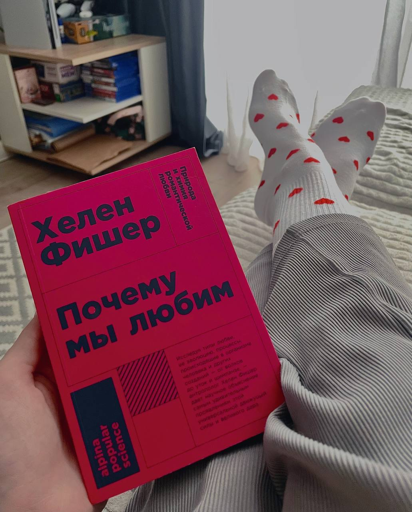
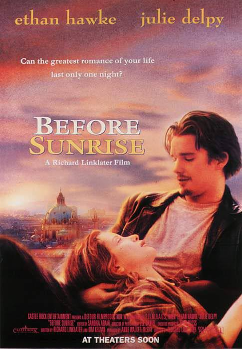

Поздравляю всех с днем любви ❤️

Любовь - это способность быть живым рядом с другим человеком, быть настоящим. 

Это возможность ошибаться, быть слабым и уязвимым, быть смешным и глупым, быть разным, быть собой. 

## Любовь — это выбор

Любовь - это выбор

🤍Выбор оставаться, когда проще уйти

🩵Выбор быть честным и искренним, даже если страшно 

🩷Выбор не функции, а человека

Фильм, который я вспоминаю на тему любви - это «Перед рассветом» 1995 года. 

Он про встречу двух незнакомых людей, у которых есть только один день, чтобы обсудить абсолютно всё: планы, мечты, мысли, прошлое, жизнь. 

Он про то, что истинная близость может родиться из разговора и смелости быть настоящим и эмоционально отзывчивым. 

Можно посмотреть этот фильм одному, чтобы понять, какого это, присутствовать в диалоге здесь и сейчас 
Или вместе, чтобы снова встретиться друг с другом. 

Любовь глубоко вплетена в ткань человеческой души и, на мой взгляд, это самое прекрасное, что есть в человеке.