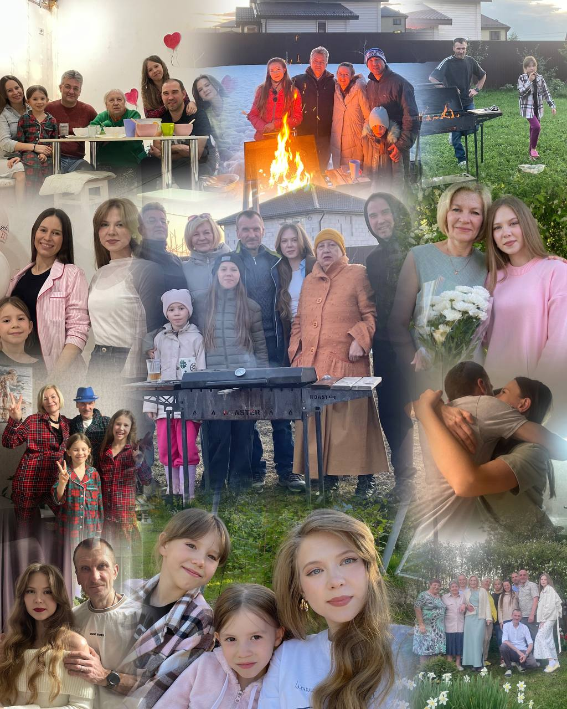

Мы часто думаем о семье, как о том, что просто есть. Но если посмотреть внимательнее, то семья - это нечто большее. 

Раньше, в другие времена, семья, брак брали на себя почти все важные функции: быт, воспитание, продолжение рода, социальную поддержку. 

В наше современное время все это мы можем получить другими путями. У нас есть работа, друзья, свои интересы, хобби, своя автономная личная жизнь. Сейчас мы можем опираться на себя, чтобы спокойно жить. 

И тогда главной функцией семьи, романтических отношений становится разделенность жизни. 

Быть друг для друга местом, где можно оставаться собой. Быть свидетелем жизни друг друга. Присутствовать в жизни друг друга. 

## Жизнестойкость семьи складывается из присутствия друг в друге

Когда рядом есть человек, с которым можно просто быть, говорить, молчать, что-то делать, жить - и тебе хорошо, то это становится ресурсом. 

Особенно в сложные моменты, когда появляются трудности, кризисные состояния и неожиданные обстоятельства, семья становится тем местом, где появляется опора и большая энергия, сила которой в: 

🫂Поддержке 

🫂Уважении 

🫂Искреннем интересе 

🫂Открытой коммуникации

🫂Традициях 

🫂Внимательном отношении, заботе и тепле. 

Из этого всего складывается жизнестойкость семьи, отношений. Ведь ты чувствуешь и видишь, что не один. 

И для этого совсем не обязательно быть «идеальной семьей», а включенной в жизнь друг друга. 

Тогда семья - это ресурс, пожалуй, один из самых сильных.